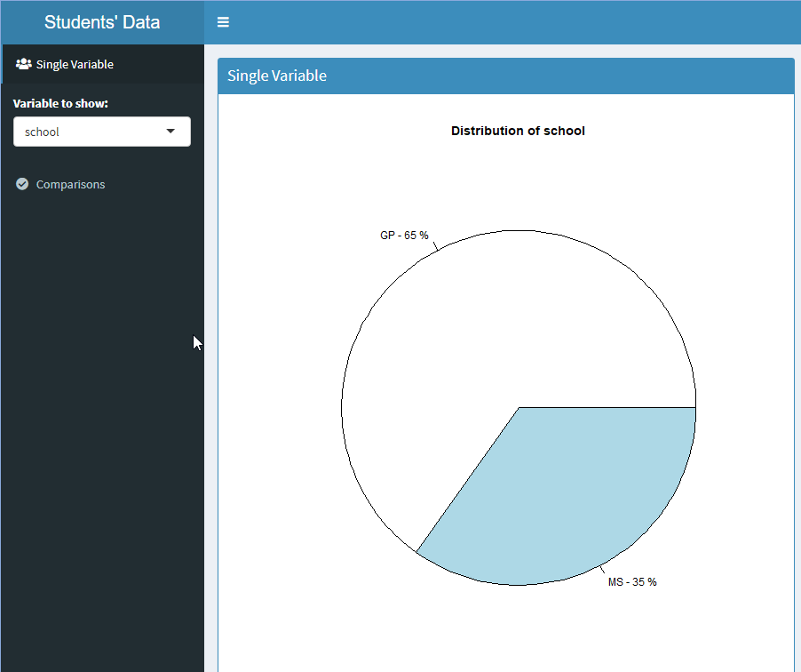
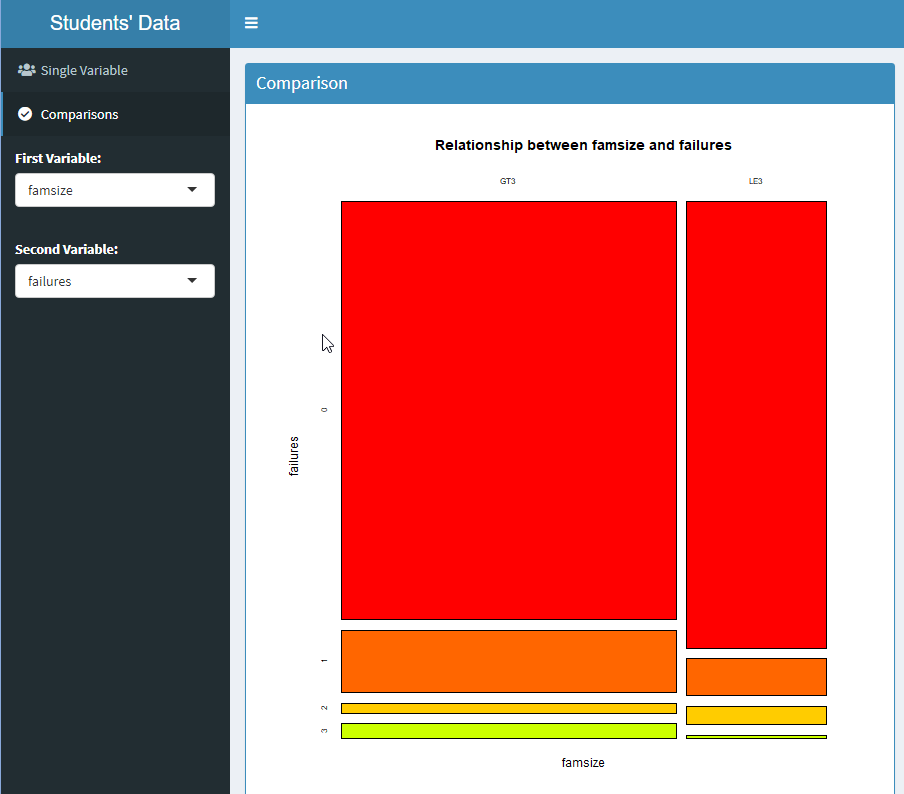

During this tutorial we will explore a simple student dataset. The main goal of this tutorial is to:

- Learn how to access simple comma separated text data (CSV)
- Learn how to obtain basic statistics of different types of variables
- Visualize the distribution of different types of variables
- Obtain contingency tables for categorical and ordinal variables
- Obtain correlation graphs for numerical variables
- Obtain boxplots for relations between categorical/ordinal variables and numerical variables
- Create a Learning Analytics dashboard to explore the dataset

This dataset is available in https://archive.ics.uci.edu/ml/datasets/student+performance and correspond to students of Portuguese (in Portugal).

## Step 1: Loading the Data

First, we will start with simple comma separated text data (CSV).  Please inspect <a href="https://raw.githubusercontent.com/xaoch/BLA2_2019/master/Week2/Tutorial/data/student-por.csv?token=AAGTX2BJ3A6HTQEMJ3IOHNK5N7TES">the file</a> to see the structure of the text. 

You can see that the first line usually contains the name of the variables, separated not by comma this time, but by a semicolon (";"):

<pre>
school;sex;age;address;famsize;Pstatus;Medu;Fedu;Mjob;Fjob;reason;guardian;traveltime;studytime;failures;schoolsup;famsup;paid;activities;nursery;higher;internet;romantic;famrel;freetime;goout;Dalc;Walc;health;absences;G1;G2;G3
</pre>

If you want to know the meaning of each one of this variables, you should consult the metadata of the dataset:

---

1. school - student's school (binary: 'GP' - Gabriel Pereira or 'MS' - Mousinho da Silveira)

2. sex - student's sex (binary: 'F' - female or 'M' - male)

3. age - student's age (numeric: from 15 to 22)

4. address - student's home address type (binary: 'U' - urban or 'R' - rural)

5. famsize - family size (binary: 'LE3' - less or equal to 3 or 'GT3' - greater than 3)

6. Pstatus - parent's cohabitation status (binary: 'T' - living together or 'A' - apart)

7. Medu - mother's education (numeric: 0 - none, 1 - primary education (4th grade), 2 – 5th to 9th grade, 3 – secondary education or 4 – higher education)

8. Fedu - father's education (numeric: 0 - none, 1 - primary education (4th grade), 2 – 5th to 9th grade, 3 – secondary education or 4 – higher education)

9. Mjob - mother's job (nominal: 'teacher', 'health' care related, civil 'services' (e.g. administrative or police), 'at_home' or 'other')

10. Fjob - father's job (nominal: 'teacher', 'health' care related, civil 'services' (e.g. administrative or police), 'at_home' or 'other')

11. reason - reason to choose this school (nominal: close to 'home', school 'reputation', 'course' preference or 'other')

12. guardian - student's guardian (nominal: 'mother', 'father' or 'other')

13. traveltime - home to school travel time (numeric: 1 - <15 min., 2 - 15 to 30 min., 3 - 30 min. to 1 hour, or 4 - >1 hour)

14. studytime - weekly study time (numeric: 1 - <2 hours, 2 - 2 to 5 hours, 3 - 5 to 10 hours, or 4 - >10 hours)

15. failures - number of past class failures (numeric: n if 1<=n<3, else 4)

16. schoolsup - extra educational support (binary: yes or no)

17. famsup - family educational support (binary: yes or no)

18. paid - extra paid classes within the course subject (Math or Portuguese) (binary: yes or no)

19. activities - extra-curricular activities (binary: yes or no)

20. nursery - attended nursery school (binary: yes or no) 

21. higher - wants to take higher education (binary: yes or no) 

22. internet - Internet access at home (binary: yes or no) 

23. romantic - with a romantic relationship (binary: yes or no) 

24. famrel - quality of family relationships (numeric: from 1 - very bad to 5 - excellent) 

25. freetime - free time after school (numeric: from 1 - very low to 5 - very high) 

26. goout - going out with friends (numeric: from 1 - very low to 5 - very high) 

27. Dalc - workday alcohol consumption (numeric: from 1 - very low to 5 - very high) 

28. Walc - weekend alcohol consumption (numeric: from 1 - very low to 5 - very high) 

29. health - current health status (numeric: from 1 - very bad to 5 - very good) 

30. absences - number of school absences (numeric: from 0 to 93) 

These grades are related with the course subject: 

31. G1 - first period grade (numeric: from 0 to 20) 

31. G2 - second period grade (numeric: from 0 to 20) 

32. G3 - final grade (numeric: from 0 to 20, output target)


Then the file contains several text rows.  Each row is the values corresponding to one student.

<pre>
"GP";"F";18;"U";"GT3";"A";4;4;"at_home";"teacher";"course";"mother";2;2;0;"yes";"no";"no";"no";"yes";"yes";"no";"no";4;3;4;1;1;3;4;"0";"11";11
</pre>

---

We will read this text file into an R dataset with the following command:

```{r}
student_data<-read.table("student-por.csv",sep=";",header=TRUE)
head(student_data)
```

<font color="darkblue">**Explanation:**

The first line is calling to the function *read.table*.  This function reads a CSV file ("student-por.csv") that is in the same directory that this tutorial.  As there are different types of CSV files, we should specify some option.  The first option is *sep*, that specify which is the character that separate different values.  In this case, the character is a ";".  The secon option is *header* that specify if the file have a first line that contains the name of the variables.  In this case, our file has such a line, so we set this option to *TRUE*. The data read from the table is assigned to the variable *student_data* using the assign symbol (*<-*). Now, we are able to access the data throgh this variable.

The second line "*head(student_data)*" just use the *head* function to present the first lines of the information stored in the *student_data* dataset.</font>

## Step 2: Variables Distributions

Once we have the data into R, we can start exploring our dataset.  The type of exploring will depend on the type of varible.  

Usually we find 3 main types of variables in our data: Nominal, Ordinal and Numerical. If you want to know more, check this <a href="https://towardsdatascience.com/data-types-in-statistics-347e152e8bee"> link </a> 

### Exploring Nominal Data

The best way to get an idea of the distribution of data of nominal variables is to count how many students have a given nominal value.  For example, it will be useful to know how many male and female students were considered into the dataset.  This information is stored in the "sex" column of the dataset.  To count the frequency of each value we will use a simple R command:
```{r}
table(student_data$sex)
```

<font color="darkblue">**Explanation:**

First, we need to let R know that we want to work over a single variable in the dataset.  For that, we use the "*student_data\$sex*" expression.  R interprets what is after the *\$* as the name of one of the data columns.  The function table create a frequency table of the different values of that variable. 

The result tell use that there are 383 female (F) students and 266 male (M) students.</font>

We can do the same for other nominal variables in the dataset:

```{r}
table(student_data$guardian)
```

<font color="darkblue">**Explanation:**

Now we get the distribution of values for who is the guardian of the students.  It seems that 41 of the students are represented at school by somebody else apart from their mother or father.</font>

While numbers are a good way to understand the difference between few nominal values, usually we want to have a graphical representation of the difference frequencies.  

There are several types of graphs that can be used, and which one you select will depend on the application.  For this example, we will use a Pie Chart.

```{r}
nominal_data<-as.data.frame(table(student_data$guardian))
colnames(nominal_data)<-c("Name","Freq")
pct <- round(nominal_data$Freq/sum(nominal_data$Freq)*100)
labels<-paste(nominal_data$Name,"-",pct,"%")
pie(nominal_data$Freq,labels, main="Distribution of Guardians")
```

<font color="darkblue">**Explanation:**
<br/>
The first line uses the *as.data.frame* function to convert the frequency table *table(student_data\$guardian)* into a new dataset that we can use to create our chart.  This new dataset is stored in the variable *nominal_data*.

The second line assign a name to the columns of this new dataset.  The first column, containing the name of the nominal value will be named "Name" and the second column, containing the frequency of that value will be named "Freq".  We use the *colnames* function to assign these names.

The third line calculates the percentages of each one of the different nominal values.  It takes the frequency of the value (*nominal_data\$Freq*) and divides it by the sum of all the frequencies (*sum(nominal_dat\$Freq)*).  Then it is multiplied by 100 and rounded to the closest integer (*round* function).

The fourth line create the labels for the graph based on the name of the nominal value (*nominal_data\$Name*), a dash, the percentage and finally a percentage sign.  The *paste* function is used to join several strings or texts.  These labels are stored in the variable labels.

Finally, the fifth line crete the pie chart.  The first argument to the function is the frequencies (*nominal_data$Freq*), the second parameter is the label for each category (*labels*).  We add a title to the pie chart with the option *main*. 

In this graph, it is very clear that the majority of students is represented by their mothers.
</font>

### Exploring Ordinal Data

Very similar to nominal data is ordinal data.  The main difference is that the order of the categories is important as they should be ordered.  In the same way, we can use a frequency table to explore the distribution of this variables:

```{r}
table(student_data$health)
```

<font color="darkblue">**Explanation:**
<br/>
We use the *table* function to obtain the frequency for different values of the Health variable.  As we can see in the metadata, this variable has five different values with an attached meaning: 
    <pre>
health - current health status (numeric: from 1 - very bad to 5 - very good)
    </pre>
As we can see in the data, most students have good or very good health, but a not small amount seem to have some illness.
</font>

If an ordinal variable is represented using numerical values, as in the case of health, R presupones that it is a numeric variable.  To avoid confusion, it is better to explicitly convert those numbers into factors.

```{r}
health_factor<-factor(student_data$health, order = TRUE, levels = c(1, 2, 3,4,5))
```

<font color="darkblue">**Explanation:**
<br/>
The *factor* function is used to convert numerical values into factors.  The options to this function are *order* that let us know that this variable is ordinal and the *levels* that represent the different values that the factor can take.  We store this factors into a new variable *health_factor*
</font>

In the same way that we did for the nominal variables, we will visualize ordinal variables, this time using a Bar Chart.

```{r}
plot(health_factor,col = rainbow(5),main="Distribution",xlab="Health",ylab="Students")
```

<font color="darkblue">**Explanation:**
<br/>
We use the *plot* function to show a Bar Chart of the health_factors.  The plot function takes as arguments the values to be represented (*health_factor*), five colors taken from the *rainbow* function "*col=rainbow(5)*", the title of the graph (*main*), the label of the x axis (*xlab*) and the label of the y axis (*ylab*). 
</font>

We can do the same for another ordinal value in the dataset:

```{r}
mother_education<-factor(student_data$Medu, order = TRUE, levels = c(0, 1, 2,3,4))
plot(mother_education,col = rainbow(5),main="Distribution of Mother Education",xlab="Education Level",ylab="Students")
```

<font color="darkblue">**Explanation:**
<br/>
Notice that mother education hat 5 levels, but numbered from 0 to 4.  
</font>

### Exploring Numerical Data

The distribution of numerical data is better understood using statistics.  With numerical value, the mean and the quartiles could give you .  We can obtain that information from a numerical variable using the summary function:

```{r}
summary(student_data$age)
```

<font color="darkblue">**Explanation:**
<br/>
The *summary* function returns the minimum, maximum, mean, median and 1st. and 3rd. quartiles.  These values give you an idea of the distribution of numerical variables.  In this case, the age of the students fluctuates between 15 and 22 years.  The mean value for the age is 16.74.  The distribution is skewed to lower ages.
</font>

A graphical representation of this distribution is desirable.  The easiest way to do it is by an histogram.

```{r}
hist(student_data$age,main="Age Histogram",xlab="Years",ylab="Students")
```

<font color="darkblue">**Explanation:**
<br/>
The *histogram* show how many values are between a given range.  In this case the range is 1 year long.  The width of the range interval (called bin) can be configured.
</font>

If the numerical variable is continuous or have a large amount of distinct values, a density plot is a better alternative.

```{r}
plot(density(student_data$absences),main="Density Plot of Absenses", xlab="Absences",ylab="Fraction of Students (from 0 to 1)")
```

<font color="darkblue">**Explanation:**
<br/>
The density plot is a representation of which fraction of the values have a given value.  The *density* function calculates the distribution of the values of the variable.  The *plot* function is used to show this distribution.
</font>

Another useful way to show the distribution of numerical variables are the Boxplots.  

```{r}
summary(student_data$G3)
boxplot(student_data$G3,main="Distribution of Final Grades", ylab="Final Grade")
```


<font color="darkblue">**Explanation:**
<br/>
The code first shows the summary of the Final Grade (G3) variable and then shows its boxplot.  The information shown in the boxplot is essentially the same that what is numerically presented in the summary.
</font>

## Step 3: Relations between Variables

While exploring single variables is interesting, much more information is usually extracted by the relationships that exists between different variables.  Again how to obtain and present these relationships depends in the type of variables that are being used.

### Relationships Between Nominal and Ordinal Variables

The best way to visually explore how two nominal or ordinal variables are related, is to create a cross tabulation or more commonly know as a "Contingency Table".  

```{r}
xt<-xtabs(~ address + Medu, data = student_data)
plot(xt, col = rainbow(5), main="Relationship between Location and Mother Education",xlab="Address",ylab="Mother Education")
```

<font color="darkblue">**Explanation:**
<br/>
The *xtabs* function is the responbile of calculating the relationship between the two varibles (in this case Address, a nominal variable, and Mother Education, a ordinal varible).  The first parameter for the xtabs function is the relationship formula.  This formula should be in the format "~ variable1 + variable2" where variable1 and variable2 are the variables that we want to contrast.  The second option is the dataset from which these variables will be taken.
<br/>    
The result of the *xtabs* function (*xt*) is given to the *plot* function. The second option are the colors.  There should be as many colors as there is values of the second variable.
<br/>
In this case we can observe that in rural areas, mothers tend to have lower levels of education than in urban areas.  A expected, although worrisome, fact.
</font>

### Relationship between Numerical Variables

When the relationship between numerical variables is required, the usual method is to obtain the linear correlation between them.  The best way to visually establish this correlation is the Scatter Plot.

```{r}
cor(student_data$G1,student_data$G2)
plot(student_data$G1,student_data$G2, main="Relationship between the Grades", xlab="Points First Examination",ylab="Points Second Examination")
abline(lm(student_data$G1 ~ student_data$G2), col="red")
```

<font color="darkblue">**Explanation:**
<br/>
The first line calculate the correlation coefficient between the two variables and present it.

The second line graphs just plot the two varibles together, one in the x-axis and the other in the y-axis.  A linear relationship is easily spoted by a linear trend in the graph.
   
The third line estimate a linear model (*lm*) between the two variables and graph a red line to better present the relationship.

We can found an expected high level of correlation (0.87) between the first and second examination grades.
</font>

Of course, the linear relationship is not always as clear:

```{r}
cor(student_data$G1,student_data$age)
plot(student_data$G1,student_data$age, main="Relationship between Grade and Age", xlab="Points First Examination",ylab="Age")
abline(lm(student_data$G1 ~ student_data$age), col="red")
```

<font color="darkblue">**Explanation:**
<br/>
The is no correlation between these age and grades. 
</font>

### Relationship between Numerical and Nominal/Ordinal Variables

When we want to visually explore the relationship between nominal/ordinal variables with numerical variables, the best way is to create grouped boxplots. 

```{r}
boxplot(G3~internet,data=student_data, main="Relationship between Final Grade and Internet Access", xlab="Internet at Home", ylab="Final Grade")
```

<font color="darkblue">**Explanation:**
<br/>
The *boxplot* function could also receive a relationship formula "numericalVariable ~ nominalVariable˜, together with a dataset from which to take those variables, to present several boxplots, one for each value in the nominal or ordinal Variable.
<br/>
Here we can see that there is no major difference between the mean grade between students that has and do not have internet access.
</font>

## Step 4: Creating a Learning Analytics Dashboard to Explore the Student Data

Now that we know how to explore the different variables and their relationships, we will create a very simple Learning Analytics dashboard that will enable us and others to explore the dataset.

For this we will create a dashboard that has two different visualizations: Single Variable and Comparisons.

**Single Variable**: A combo box should appear to select the variable that we want to visualize.  If the variable is nominal, it should create a Pie.  If the variable is ordinal, it should create a bar plot and if the variable is numerical, it create an historgram.



**Comparisons**: Two combo box should appear to select the two variables to compare. The second combo box should not show the variable selected in the first combo.  If the two variables are ordinal or nominal, a crosstable should be shown.  If the combination is numerical with ordinal or nominal, a boxplot should be generated.



**NOTE: The code here has to be run in a separate file (RStudio-> File -> New File -> Shiny Web App).  Select a name and select a directory.  Copy the data file to that directory (where the app.R file is)**

```{r}
library(shiny)
library(shinydashboard)
```

<font color="darkblue">**Explanation:**
<br/>
We are telling R to create import the shiny and shinydashboard libraries.
</font>

```{r}
# Loading student data
student_data=read.table("student-por.csv",sep=";",header=TRUE)

# Generating variables names and types dataset
variables = names(student_data)
types=c("nominal","nominal","ordinal","nominal","nominal","nominal","ordinal","ordinal","nominal","nominal","nominal","nominal","ordinal","ordinal","ordinal","nominal","nominal","nominal","nominal","nominal","nominal","nominal","nominal","ordinal","ordinal","ordinal","ordinal","ordinal","ordinal","numerical","numerical","numerical","numerical")
var_df = data.frame(variables, types) 
```


<font color="darkblue">**Explanation:**
<br/>
First we read the data file into the student_data variable.
<br/>

To be able to generate the right visualization for each variable, we need to know the type of each variable.  For this, we generate a dataset that will contain the name and type of all the variables.  The names of the variables are stores in the "variables" variable and the types variable contains the list of "nominal", "ordinal" or "numerical" according to the type of variable.  We use the data.frame function to create a dataframe with this information and we stored it in var_df.  This list is created manually, because there is not foolproof way to determine them automatically.
</font>

Now we need to create the User Inteface (UI) of our dashboard.  The UI for a shinydashboard has three elements: the header, the sidebar and the body.  The header only has information about the title of the dashboard, the sidebar has the link to the different tabs and the interactive controls and the body usually contains the visualization(s).

This is the code of our ui:

```{r}
ui <- dashboardPage(
    dashboardHeader(title = "Students' Data"),
    dashboardSidebar(
        sidebarMenu(id = "sidebarmenu",
                    menuItem("Single Variable", 
                             tabName = "single",  
                             icon = icon("chart-pie", 
                                         lib="font-awesome")
                             ),
                    conditionalPanel(
                      condition = "input.sidebarmenu == 'single'",
                      selectInput("variable",
                                  label = "Variable to show:", 
                                  choices = var_df$variables, 
                                  selected = "school")
                      ),
                    menuItem("Comparisons", 
                             tabName = "comparisons", 
                             icon = icon("chart-line", 
                                         lib = "font-awesome")
                             ),
                    conditionalPanel(
                      condition = "input.sidebarmenu == 'comparisons'",
                      selectInput("variable1", 
                                  label = "First Variable:",
                                  choices = var_df$variables, 
                                  selected = "school"),
                      uiOutput("secondSelection")
                      )
                    )

         ),
    dashboardBody(
        tabItems(
            tabItem(tabName = "single",
                    fluidRow(
                        box(title = "Single Variable", 
                            status = "primary", 
                            solidHeader = TRUE,
                            plotOutput("plot1",
                                       height=700), 
                            width=12, 
                            height="800")
                        )
                    ),
            
            tabItem(tabName = "comparisons",
                    fluidRow(
                        box(title = "Comparison", 
                            status = "primary", 
                            solidHeader = TRUE,
                            plotOutput("plot2",
                                       height=700),
                            width=12, 
                            height="800")
                    )
            )
        )
        
    )
)
```

<font color="darkblue">**Explanation:**
<br/>
This code looks complicated, but are just the instructions to build the User Interface.  

First, we will set the Dasbhboar Header with the title "Students' Data".

Second we configure the Sidebar, if we remember from the examples, this sidebar has to have two links to the corresponding components of the dashboard, the Single Variable and Comparisions.  For each Tab we need to set the name of menu item (e.g. "Single Variable"), the name of the tab that they will open (e.g. tabname="single") and the icon that they will display (e.g.  icon = icon("chart-line", lib = "font-awesome") ).

Because each tab will have different selectors for the variables, we create two conditional elements.  They will only be displayed if their conditions is met.  In this case, the condition is that their tab has been selected. (e.g. condition = "input.sidebarmenu == 'single'", that means that in the side bar named "sidebarmenu", the selected tab is "single").  For the Single Variable tab, the selector is a list of all the variables stored in the var_df dataset that we created in the beginning.  For the SelectInput we need to specify the name, the label that will appear in the menu, the list of the choices (in this case the name of the variables) and the element that will be selected at the beginning (in this case "schools").  

For the second tab, "Comparisons" we need two InputSelectors that will determine the two variables to be compared.  The first Input Selector is identical to the one in the "Single Variable" tab.  However, the second selector should contains all the variables, except the one that is already selected in the first InputSelector.  For that we need to calculate its contents, based on the previous input.  Because this is dynamic component, we need to create it in the server code.  In this section we just indicate the place that it will have with "uiOutput("secondSelection")".

The body element contains the two tabs and the their visualization.  The first tabItem will have one row and inside that row, there will be a box.  That box has a title,  status, the color and type of header of the box and a height.  Inside the box, we define the plot that will be shown.  In the first tab is the Plot 1 (output\$plot1) and in the second tab is the Plot 2 (output\$plot2).  Because this plots are dynamic and depend on the selection of the inputs, they are calculated in the server code.
<br/>
</font>

Once the UI is specified, we need to add the code that will generate the plots.  We do this in the server component:

```{r}
server <- function(input, output) {

    output$plot1 <- renderPlot({
        variableType =var_df[var_df$variable==input$variable,]$types
        
        if (variableType=="numerical"){
            hist(student_data[[input$variable]],
                 main=paste("Distribution of",input$variable),
                 xlab=input$variable,
                 ylab="Students")
        }
        if (variableType=="ordinal"){
            factors=factor(student_data[[input$variable]], order = TRUE)
            plot(factors,col = rainbow(15),
                 main=paste("Distribution of",input$variable),
                 xlab=input$variable,
                 ylab="Students")
        }
        if (variableType=="nominal"){
            nominal_data<-as.data.frame(table(student_data[[input$variable]]))
            colnames(nominal_data)<-c("Name","Freq")
            pct <- round(nominal_data$Freq/sum(nominal_data$Freq)*100)
            labels<-paste(nominal_data$Name,"-",pct,"%")
            pie(nominal_data$Freq,
                labels, 
                main=paste("Distribution of",input$variable))
        }
    })
    
    output$plot2 <-renderPlot({
        type1=var_df[var_df$variable==input$variable1,]$types
        type2=var_df[var_df$variable==input$variable2,]$types
        title=paste("Relationship between",input$variable1,"and",input$variable2)
        
        if (type1=="numerical" & type2=="numerical"){
            plot(student_data[[input$variable1]],
                 student_data[[input$variable2]],
                 main=title,
                 xlab=input$variable1,
                 ylab=input$variable2)
        }
        
        if(type1=="numerical" & (type2=="ordinal" | type2=="nominal")){
            formula=as.formula(paste(input$variable1,"~",input$variable2)) 
            boxplot(formula,
                    data=student_data,
                    main=title,
                    xlab=input$variable1,
                    ylab=input$variable2)    
        }
        
        if((type1=="ordinal" | type1=="nominal") & (type2=="ordinal" | type2=="nominal")){
            formula=as.formula(paste("~",input$variable1,"+",input$variable2))  
            xt=xtabs(formula, data = student_data)
            plot(xt, 
                 col = rainbow(15), 
                 main=title,
                 xlab=input$variable1,
                 ylab=input$variable2)
        }
        
        if((type1=="ordinal" | type1=="nominal") & type2=="numerical"){
            formula=as.formula(paste(input$variable2,"~",input$variable1)) 
            boxplot(formula,
                    data=student_data,
                    main=title,
                    xlab=input$variable1,
                    ylab=input$variable2)
        }
    })
    
    output$secondSelection <- renderUI({
        selectInput("variable2", 
                    label="Second Variable:", 
                    choices = var_df[var_df$variable!=input$variable1,]$variables,
                    selected=var_df[var_df$variable!=input$variable1,]$variables[0])
    })
    
}
```

<font color="darkblue">**Explanation:**
<br/>
This code also looks complicated, but are just the instructions to calculate the plots and the dynamic input selector.  

The first plot (plot1) depends if the selected variable is "nominal", "ordinal" or "numerical".  If it is nominal, we generate a pie chart, if it is ordinal, we generate a bar plot and if it is numerical we generate a histogram.

The second plot (plot2) selection is a little more complicated.  If the selected variables are both nominal or ordinal, we generate a contigency table.  If both variables are numerical, we generate a scatter plot.  Finally, if one variable is nominal or ordinal and the other is numerical, we generate a boxplot.  Review the "if" conditions to check that this is the result obtained from this code.

Finally, we generate the second selector for the Comparision Side menu.  We create a selectInput where the choices are all the elements the variable names that are not the one selected in the first selector (input$variable1).

<br/>
</font>
Finally, we need to run the shiny applycation, for that we run the following code:

```{r}
shinyApp(ui = ui, server = server)
```

<font color="darkblue">**Explanation:**
<br/>
We are just telling R that we want a Shiny application with the UI that we describe and the server code specified before.

<br/>
</font>
The result should look like the dashboard shown at the beginning of this step.  From this window you can publish your dashboard for everybody to see and use.  

